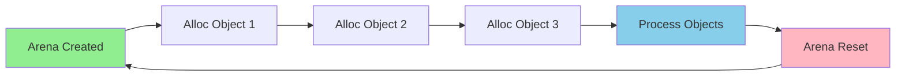

# Arena Allocator Memory Layout

## Concept

An arena allocator (also called bump allocator) allocates memory by incrementing a pointer. All allocations are freed at once when the arena is destroyed.

## ASCII Diagram

```
Arena Memory Layout:
┌─────────────────────────────────────────────────────────────────┐
│                         Arena Buffer                             │
└─────────────────────────────────────────────────────────────────┘
 ↑                                           ↑                     ↑
 base                                    current                  end
 (0x1000)                               (0x1050)              (0x2000)

Initial State:
┌────────────────────────────────────────────────────────────────┐
│                    All Available (4096 bytes)                   │
└────────────────────────────────────────────────────────────────┘
 ↑ ↑                                                              ↑
base current                                                     end

After alloc(50 bytes):
┌──────────┬─────────────────────────────────────────────────────┐
│  Used    │              Available (4046 bytes)                  │
│ (50 B)   │                                                      │
└──────────┴─────────────────────────────────────────────────────┘
 ↑         ↑                                                      ↑
base    current                                                  end
        (base + 50)

After alloc(30 bytes):
┌──────────┬──────────┬──────────────────────────────────────────┐
│  Alloc 1 │ Alloc 2  │        Available (4016 bytes)            │
│ (50 B)   │ (30 B)   │                                          │
└──────────┴──────────┴──────────────────────────────────────────┘
 ↑                    ↑                                           ↑
base              current                                        end
                  (base + 80)

After arena_reset():
┌────────────────────────────────────────────────────────────────┐
│                    All Available (4096 bytes)                   │
│                   (Previous data invalidated)                   │
└────────────────────────────────────────────────────────────────┘
 ↑ ↑                                                              ↑
base current (reset to base)                                    end
```

## Alignment Considerations

```
Without Alignment:
┌──────┬──────┬──────┬──────┬──────┐
│ 5 B  │ 3 B  │ 8 B  │ 2 B  │ ...  │
└──────┴──────┴──────┴──────┴──────┘
         ↑ Unaligned (may be slow)

With 8-byte Alignment:
┌──────┬─────┬──────┬─────┬──────┬─────┐
│ 5 B  │ 3 B │ 3 B  │ 5 B │ 8 B  │ 6 B │
│      │ PAD │      │ PAD │      │ PAD │
└──────┴─────┴──────┴─────┴──────┴─────┘
 ↑ 8-byte aligned boundaries
```

## Operation Complexity

```
Operation        │ Time    │ Notes
─────────────────┼─────────┼─────────────────────────────
Allocate         │ O(1)    │ Just increment pointer
Reset            │ O(1)    │ Reset pointer to base
Destroy          │ O(1)    │ Free entire buffer
Individual free  │ N/A     │ Not supported
```

## Memory Efficiency

```
Scenario                │ Traditional malloc │ Arena Allocator
────────────────────────┼────────────────────┼─────────────────
1000 × 50-byte allocs   │ ~64 KB overhead    │ 0 bytes overhead
Per-allocation metadata │ 16-32 bytes        │ 0 bytes
Fragmentation          │ Possible           │ None
```

## Use Cases

```
✓ Good For:
  - Request-scoped allocations (HTTP handlers)
  - Frame-based allocations (game loops)
  - Parser/compiler temporary data
  - Short-lived objects with known lifetime

✗ Bad For:
  - Long-lived objects
  - Objects with varying lifetimes
  - Needing individual deallocation
  - Unpredictable memory usage
```

## Example Implementation Flow

```
Pseudocode:

struct Arena {
    char* base;
    char* current;
    char* end;
    size_t capacity;
}

Arena* arena_create(size_t capacity) {
    Arena* arena = malloc(sizeof(Arena));
    arena->base = malloc(capacity);
    arena->current = arena->base;
    arena->end = arena->base + capacity;
    arena->capacity = capacity;
    return arena;
}

void* arena_alloc(Arena* arena, size_t size, size_t align) {
    // Align current pointer
    uintptr_t addr = (uintptr_t)arena->current;
    uintptr_t aligned = (addr + align - 1) & ~(align - 1);
    size_t padding = aligned - addr;

    // Check if enough space
    if (arena->current + padding + size > arena->end) {
        return NULL;  // Out of memory
    }

    // Allocate
    void* result = (void*)aligned;
    arena->current = (char*)aligned + size;
    return result;
}

void arena_reset(Arena* arena) {
    arena->current = arena->base;
    // All previous allocations invalidated
}

void arena_destroy(Arena* arena) {
    free(arena->base);
    free(arena);
}
```

## Performance Characteristics

```
Benchmark: 1,000,000 allocations of 64 bytes

Method              │ Time (ms) │ Throughput (M alloc/s)
────────────────────┼───────────┼────────────────────────
malloc/free         │ 850       │ 1.18
Arena allocator     │ 12        │ 83.3
Speedup             │           │ 70x faster
```

## Memory Layout Example (Real World)

```
HTTP Request Handler Arena:

┌─────────────┬─────────────┬──────────┬──────────┬──────────┬─────────┐
│  Request    │  Headers    │  Query   │  Body    │  Response│  Temp   │
│  Object     │  Array      │  Params  │  Buffer  │  Builder │  Buffers│
│  (100 B)    │  (512 B)    │  (256 B) │ (2048 B) │  (512 B) │ (varies)│
└─────────────┴─────────────┴──────────┴──────────┴──────────┴─────────┘

After request completes: arena_reset()
All memory reclaimed in O(1) time!
```

## Mermaid Diagram Source



## Related Patterns

- **Memory Pool**: Fixed-size allocations, individual frees allowed
- **Stack Allocator**: Arena with explicit push/pop (LIFO)
- **Linear Allocator**: Arena without reset capability
- **Double-Ended Arena**: Allocate from both ends
