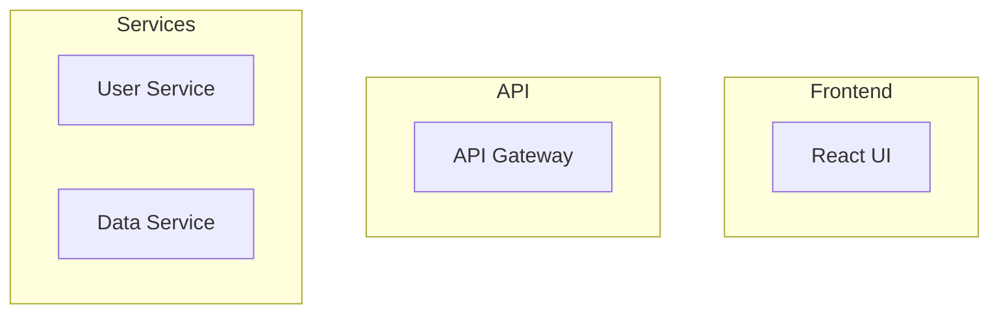

# Automated Documentation Generation

Generate comprehensive, maintainable documentation from code using AI-powered analysis and industry best practices.

## Execution Modes

| Mode | Time | Use Case | Output |
|------|------|----------|--------|
| **quick** | 10-15 min | README + basic API docs | README.md, API.md |
| **standard** (default) | 20-30 min | Complete docs with examples | README, API docs, examples |
| **comprehensive** | 40-60 min | Full doc site + CI/CD | Sphinx site, OpenAPI, automation |

## Quick Reference Documentation

| Topic | External Documentation | Lines |
|-------|------------------------|-------|
| API Templates | [api-documentation-templates.md](../docs/code-documentation/api-documentation-templates.md) | ~550 |
| Automation | [documentation-automation.md](../docs/code-documentation/documentation-automation.md) | ~300 |

**Total External Documentation**: ~850 lines of templates and automation patterns

## Arguments

$ARGUMENTS

**Supported flags**:
- `--api`: Focus on API documentation only
- `--readme`: Focus on README generation only
- `--sphinx`: Generate Sphinx documentation
- `--full`: Complete documentation overhaul (same as comprehensive mode)

## Core Workflow

### Phase 1: Code Analysis

**Extract structure from codebase**:

1. **Identify project type** (Python, JavaScript, Go, etc.)
2. **Parse code structure** using AST (classes, functions, endpoints)
3. **Extract API endpoints** from route decorators/annotations
4. **Extract schemas** (Pydantic models, TypeScript interfaces)
5. **Analyze dependencies** and configuration

**For API endpoint extraction**, see [api-documentation-templates.md](../docs/code-documentation/api-documentation-templates.md#api-endpoint-extraction):
- `APIDocExtractor` class for Python
- Route decorator detection
- Parameter and return type extraction
- Pydantic schema extraction

### Phase 2: API Documentation Generation

**Create comprehensive API docs**:

1. **Generate OpenAPI 3.0 specification** from extracted endpoints
2. **Create interactive documentation** (Swagger UI, Redoc)
3. **Generate code examples** in multiple languages (Python, JavaScript, cURL, Go)
4. **Document authentication** and rate limiting
5. **Include request/response examples**

**OpenAPI template**: See [api-documentation-templates.md](../docs/code-documentation/api-documentation-templates.md#complete-openapi-30-template) for:
- Full OpenAPI 3.0 specification structure
- Component schemas (User, Pagination, Error)
- Security schemes (Bearer auth, API keys)
- Response templates (200, 401, 404, 429)
- Multi-language code examples

**FastAPI integration**: Automatic documentation with Pydantic models

### Phase 3: README Generation

**Create comprehensive README** with:

1. **Project overview** and features
2. **Installation instructions** (pip, npm, cargo, from source)
3. **Quick start examples** showing core functionality
4. **Configuration options** (environment variables, config files)
5. **Development setup** and testing
6. **Contribution guidelines** and license

**Template structure**:
```markdown
# Project Name

[Badges: CI/CD, Coverage, Version]

## Overview
[2-3 sentence description]

## Features
- Feature 1
- Feature 2

## Installation
[Multiple install methods]

## Quick Start
[Simple, compelling example]

## Documentation
[Links to full docs]

## Configuration
[Environment variables table]

## Development
[Setup and testing]
```

**Implementation**: See [documentation-automation.md](../docs/code-documentation/documentation-automation.md#readme-generation) for template code

### Phase 4: Architecture Diagrams

**Visual representations** of system structure:

1. **System architecture** (components and connections)
2. **API flow diagrams** (request/response paths)
3. **Database schema** (if applicable)
4. **Deployment architecture** (if infrastructure exists)

**Mermaid diagrams**:


### Phase 5: Code Examples and Tutorials

**Create practical examples**:

1. **Basic usage examples** for common tasks
2. **Advanced use cases** for complex scenarios
3. **Integration examples** with other services
4. **Error handling** examples
5. **Best practices** demonstrations

**Example structure**:
- Complete, runnable code
- Inline comments explaining key parts
- Expected output shown
- Common pitfalls noted

### Phase 6: Documentation Automation (Comprehensive mode)

**Set up CI/CD for docs**:

1. **GitHub Actions workflow** for automatic doc generation
2. **Pre-commit hooks** for documentation linting
3. **Documentation coverage** checks
4. **Automated deployment** to GitHub Pages/Netlify/ReadTheDocs

**GitHub Actions**: See [documentation-automation.md](../docs/code-documentation/documentation-automation.md#github-actions-workflow) for:
- Complete workflow YAML
- OpenAPI generation
- Sphinx build automation
- Coverage validation
- Deployment to GitHub Pages

**Pre-commit hooks**:
```yaml
repos:
  - repo: https://github.com/igorshubovych/markdownlint-cli
    hooks:
      - id: markdownlint

  - repo: local
    hooks:
      - id: doc-coverage
        entry: interrogate
        args: ['--fail-under', '80']
```

### Phase 7: Sphinx Documentation (if --sphinx or comprehensive)

**For Python projects with Sphinx**:

1. **Generate conf.py** with autodoc configuration
2. **Create index.rst** with toctree
3. **Generate API reference** with autosummary
4. **Add examples** and tutorials
5. **Configure theme** and deployment

**Sphinx setup**: See [sphinx-optimization.md](../docs/code-documentation/sphinx-optimization.md) for complete configuration

## Mode-Specific Execution

### Quick Mode (10-15 minutes)
**Output**:
- README.md
- API.md (basic endpoint listing)
**Skip**: Sphinx, CI/CD, advanced examples

### Standard Mode (20-30 minutes) - DEFAULT
**Output**:
- README.md (comprehensive)
- OpenAPI spec
- API documentation with examples
- Basic architecture diagrams
**Skip**: CI/CD automation, Sphinx

### Comprehensive Mode (40-60 minutes)
**Output**:
- Complete README
- Full OpenAPI with Swagger UI/Redoc
- Sphinx documentation site
- CI/CD workflows
- Pre-commit hooks
- Documentation coverage reports

## Documentation Quality Standards

All generated documentation must:

✅ Be accurate and synchronized with current code
✅ Use consistent terminology and formatting
✅ Include practical examples and use cases
✅ Be searchable and well-organized
✅ Follow accessibility best practices
✅ Include API versioning information
✅ Provide troubleshooting guides
✅ Link to related documentation

## Output Structure

### For API Projects

```
docs/
├── README.md                 # Main documentation
├── API.md                    # API reference
├── api/
│   ├── openapi.json         # OpenAPI spec
│   ├── swagger-ui.html      # Interactive docs
│   └── examples/            # Code examples
├── examples/
│   ├── basic-usage.md
│   ├── advanced.md
│   └── integrations.md
└── diagrams/
    └── architecture.md
```

### For Python Projects with Sphinx

```
docs/
├── source/
│   ├── index.rst
│   ├── installation.rst
│   ├── quickstart.rst
│   ├── api/
│   │   ├── index.rst
│   │   └── modules.rst
│   └── examples/
│       └── basic.rst
├── conf.py
└── Makefile
```

## Interactive Documentation Setup

**Swagger UI**: See [api-documentation-templates.md](../docs/code-documentation/api-documentation-templates.md#swagger-ui-html-template) for HTML setup

**Redoc**: Alternative documentation UI with cleaner design

**FastAPI**: Built-in Swagger UI at `/docs` and Redoc at `/redoc`

## Documentation Coverage Validation

**Python coverage**:
```python
from documentation_automation import DocCoverage

coverage = DocCoverage()
results = coverage.check_coverage('src/')

print(f"Function coverage: {results['function_coverage']:.1f}%")
print(f"Class coverage: {results['class_coverage']:.1f}%")
```

**Implementation**: See [documentation-automation.md](../docs/code-documentation/documentation-automation.md#documentation-coverage-validation)

## Success Criteria

✅ All public APIs documented
✅ README is comprehensive and clear
✅ Installation instructions tested
✅ Code examples are runnable
✅ API documentation includes authentication
✅ Architecture diagrams accurately represent system
✅ Documentation builds without errors
✅ Links are not broken
✅ Coverage > 80% for public APIs

Focus on creating **living documentation** that stays synchronized with code changes through automation and CI/CD integration.
