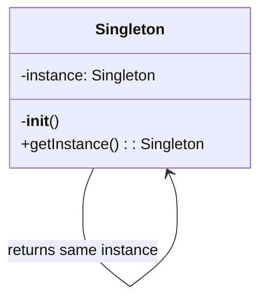
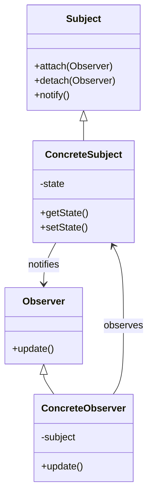

# Learning Resources

**Version**: 1.0.3
**Category**: code-documentation
**Purpose**: Design pattern explanations, concept tutorials, and personalized learning paths

## Overview

Comprehensive explanations of programming concepts, design patterns, and learning resources to help developers understand complex code at all skill levels.

## Design Pattern Explanations

### Singleton Pattern

```markdown
## Singleton Pattern

### What is it?
The Singleton pattern ensures a class has only one instance and provides global access to it.

### When to use it?
- Database connections
- Configuration managers
- Logging services
- Cache managers

### Visual Representation:


### Python Implementation:
```python
class DatabaseConnection:
    _instance = None

    def __new__(cls):
        if cls._instance is None:
            cls._instance = super().__new__(cls)
            cls._instance._initialize()
        return cls._instance

    def _initialize(self):
        self.connection = create_connection()

# Usage
db1 = DatabaseConnection()
db2 = DatabaseConnection()
assert db1 is db2  # Same instance
```

### Benefits:
✅ Controlled access to single instance
✅ Reduced namespace pollution
✅ Permits refinement of operations

### Drawbacks:
❌ Can make unit testing difficult
❌ Violates Single Responsibility Principle
❌ Can hide dependencies

### Alternative Approaches:
1. Dependency Injection
2. Module-level singleton
3. Borg pattern
```

### Observer Pattern

```markdown
## Observer Pattern

### What is it?
The Observer pattern defines a one-to-many dependency between objects so that when one object changes state, all dependents are notified.

### When to use it?
- Event handling systems
- Model-View architectures
- Distributed event handling
- Real-time data updates

### Visual Representation:


### Real-world Example:
```python
# Newsletter subscription system
class Newsletter:
    def __init__(self):
        self._subscribers = []
        self._latest_article = None

    def subscribe(self, subscriber):
        self._subscribers.append(subscriber)

    def unsubscribe(self, subscriber):
        self._subscribers.remove(subscriber)

    def publish_article(self, article):
        self._latest_article = article
        self._notify_subscribers()

    def _notify_subscribers(self):
        for subscriber in self._subscribers:
            subscriber.update(self._latest_article)

class EmailSubscriber:
    def __init__(self, email):
        self.email = email

    def update(self, article):
        print(f"Sending email to {self.email}: New article - {article}")

# Usage
newsletter = Newsletter()
sub1 = EmailSubscriber("user1@example.com")
sub2 = EmailSubscriber("user2@example.com")

newsletter.subscribe(sub1)
newsletter.subscribe(sub2)
newsletter.publish_article("Python Design Patterns")
```

### Benefits:
✅ Loose coupling between subject and observers
✅ Dynamic subscription/unsubscription
✅ Supports broadcast communication

### Drawbacks:
❌ Can cause memory leaks if observers aren't unsubscribed
❌ Order of notification is not guaranteed
❌ Can lead to unexpected cascading updates
```

### Factory Pattern

```markdown
## Factory Pattern

### What is it?
Factory pattern provides an interface for creating objects without specifying exact classes.

### When to use it?
- Complex object creation logic
- Multiple object types with common interface
- Decoupling object creation from usage

### Implementation:
```python
from abc import ABC, abstractmethod

class Animal(ABC):
    @abstractmethod
    def speak(self):
        pass

class Dog(Animal):
    def speak(self):
        return "Woof!"

class Cat(Animal):
    def speak(self):
        return "Meow!"

class AnimalFactory:
    @staticmethod
    def create_animal(animal_type):
        if animal_type == "dog":
            return Dog()
        elif animal_type == "cat":
            return Cat()
        else:
            raise ValueError(f"Unknown animal type: {animal_type}")

# Usage
factory = AnimalFactory()
pet = factory.create_animal("dog")
print(pet.speak())  # Woof!
```

### Benefits:
✅ Centralized object creation
✅ Easy to add new types
✅ Follows Open/Closed Principle

### Drawbacks:
❌ Can become complex with many types
❌ Requires updates when adding new products
```

## Programming Concept Explanations

### Decorators

```markdown
## Understanding Decorators

Decorators are a way to modify or enhance functions without changing their code directly.

**Simple Analogy**: Think of a decorator like gift wrapping - it adds something extra around the original item.

### How it works:
```python
# This decorator:
@timer
def slow_function():
    time.sleep(1)

# Is equivalent to:
def slow_function():
    time.sleep(1)
slow_function = timer(slow_function)
```

### Creating a Decorator:
```python
import time

def timer(func):
    def wrapper(*args, **kwargs):
        start = time.time()
        result = func(*args, **kwargs)
        end = time.time()
        print(f"{func.__name__} took {end - start:.2f} seconds")
        return result
    return wrapper

@timer
def process_data(n):
    total = sum(range(n))
    return total

# Usage
process_data(1000000)  # Prints: process_data took 0.05 seconds
```

### Common Use Cases:
- **Timing**: Measure execution time
- **Logging**: Log function calls
- **Authentication**: Check permissions
- **Caching**: Memoize results
- **Validation**: Check input parameters
```

### Generators

```markdown
## Understanding Generators

Generators produce values one at a time, saving memory by not creating all values at once.

**Simple Analogy**: Like a ticket dispenser that gives one ticket at a time, rather than printing all tickets upfront.

### How it works:
```python
# Generator function
def count_up_to(n):
    i = 0
    while i < n:
        yield i  # Produces one value and pauses
        i += 1

# Using the generator
for num in count_up_to(5):
    print(num)  # Prints 0, 1, 2, 3, 4
```

### Memory Efficiency:
```python
# Bad: Creates entire list in memory
def get_numbers_list(n):
    return [i for i in range(n)]

numbers = get_numbers_list(1000000)  # 1M integers in memory

# Good: Generates one at a time
def get_numbers_generator(n):
    for i in range(n):
        yield i

numbers = get_numbers_generator(1000000)  # Minimal memory
```

### Generator Expressions:
```python
# List comprehension (creates full list)
squares_list = [x**2 for x in range(1000000)]

# Generator expression (lazy evaluation)
squares_gen = (x**2 for x in range(1000000))
```

### Benefits:
✅ Memory efficient
✅ Lazy evaluation
✅ Can represent infinite sequences
✅ Pipeline processing
```

### Async/Await

```markdown
## Understanding Async Programming

Async programming allows concurrent execution without threads, using cooperative multitasking.

### Basic Async/Await:
```python
import asyncio
import time

async def slow_operation(name, duration):
    print(f"{name} started...")
    await asyncio.sleep(duration)
    print(f"{name} completed after {duration}s")
    return f"{name} result"

async def main():
    # Sequential execution (slow)
    start = time.time()
    await slow_operation("Task 1", 2)
    await slow_operation("Task 2", 2)
    print(f"Sequential time: {time.time() - start:.2f}s")  # ~4 seconds

    # Concurrent execution (fast)
    start = time.time()
    results = await asyncio.gather(
        slow_operation("Task 3", 2),
        slow_operation("Task 4", 2)
    )
    print(f"Concurrent time: {time.time() - start:.2f}s")  # ~2 seconds
    print(f"Results: {results}")

# Run it:
asyncio.run(main())
```

### Real-world Pattern:
```python
async def fetch_data(url):
    """Simulate API call"""
    await asyncio.sleep(1)  # Simulate network delay
    return f"Data from {url}"

async def process_urls(urls):
    tasks = [fetch_data(url) for url in urls]
    results = await asyncio.gather(*tasks)
    return results

# Try with different URLs:
urls = ["api.example.com/1", "api.example.com/2", "api.example.com/3"]
results = asyncio.run(process_urls(urls))
print(results)
```

### When to use:
- **I/O-bound tasks**: Network requests, file operations, database queries
- **Many concurrent operations**: Handling multiple requests
- **Not for CPU-bound tasks**: Use multiprocessing instead
```

## Interactive Examples

### Error Handling

```markdown
## Try It Yourself: Error Handling

### Example 1: Basic Try-Except
```python
def safe_divide(a, b):
    try:
        result = a / b
        print(f"{a} / {b} = {result}")
        return result
    except ZeroDivisionError:
        print("Error: Cannot divide by zero!")
        return None
    except TypeError:
        print("Error: Please provide numbers only!")
        return None
    finally:
        print("Division attempt completed")

# Test cases - try these:
safe_divide(10, 2)    # Success case
safe_divide(10, 0)    # Division by zero
safe_divide(10, "2")  # Type error
```

### Example 2: Custom Exceptions
```python
class ValidationError(Exception):
    """Custom exception for validation errors"""
    pass

def validate_age(age):
    try:
        age = int(age)
        if age < 0:
            raise ValidationError("Age cannot be negative")
        if age > 150:
            raise ValidationError("Age seems unrealistic")
        return age
    except ValueError:
        raise ValidationError("Age must be a number")

# Try these examples:
try:
    validate_age(25)     # Valid
    validate_age(-5)     # Negative age
    validate_age("abc")  # Not a number
except ValidationError as e:
    print(f"Validation failed: {e}")
```

### Exercise: Implement Your Own
Try implementing a function that:
1. Takes a list of numbers
2. Returns their average
3. Handles empty lists
4. Handles non-numeric values
5. Uses appropriate exception handling
```

## Personalized Learning Paths

```python
def generate_learning_path(self, analysis):
    """
    Create personalized learning recommendations

    Args:
        analysis: Code analysis results with difficulty and concepts

    Returns:
        Structured learning path with resources
    """
    learning_path = {
        'current_level': analysis['difficulty_level'],
        'identified_gaps': [],
        'recommended_topics': [],
        'resources': []
    }

    # Identify knowledge gaps
    if 'async' in analysis['concepts'] and analysis['difficulty_level'] == 'beginner':
        learning_path['identified_gaps'].append('Asynchronous programming fundamentals')
        learning_path['recommended_topics'].extend([
            'Event loops',
            'Coroutines vs threads',
            'Async/await syntax',
            'Concurrent programming patterns'
        ])

    # Add resources
    learning_path['resources'] = [
        {
            'topic': 'Async Programming',
            'type': 'tutorial',
            'title': 'Async IO in Python: A Complete Walkthrough',
            'url': 'https://realpython.com/async-io-python/',
            'difficulty': 'intermediate',
            'time_estimate': '45 minutes'
        },
        {
            'topic': 'Design Patterns',
            'type': 'book',
            'title': 'Head First Design Patterns',
            'difficulty': 'beginner-friendly',
            'format': 'visual learning'
        }
    ]

    # Create structured learning plan
    learning_path['structured_plan'] = f"""
## Your Personalized Learning Path

### Week 1-2: Fundamentals
- Review basic concepts: {', '.join(learning_path['recommended_topics'][:2])}
- Complete exercises on each topic
- Build a small project using these concepts

### Week 3-4: Applied Learning
- Study the patterns in this codebase
- Refactor a simple version yourself
- Compare your approach with the original

### Week 5-6: Advanced Topics
- Explore edge cases and optimizations
- Learn about alternative approaches
- Contribute to open source projects using these patterns

### Practice Projects:
1. **Beginner**: {self._suggest_beginner_project(analysis)}
2. **Intermediate**: {self._suggest_intermediate_project(analysis)}
3. **Advanced**: {self._suggest_advanced_project(analysis)}
"""

    return learning_path
```

## Common Pitfalls Explained

```markdown
## ⚠️ Bare Except Clause

**Problem**: `except:` catches ALL exceptions, including system exits and keyboard interrupts.

### Why it's bad:
- Hides programming errors
- Makes debugging difficult
- Can catch exceptions you didn't intend to handle

### Better approach:
```python
# Bad
try:
    risky_operation()
except:
    print("Something went wrong")

# Good
try:
    risky_operation()
except (ValueError, TypeError) as e:
    print(f"Expected error: {e}")
except Exception as e:
    logger.error(f"Unexpected error: {e}")
    raise
```

## ⚠️ Global Variable Usage

**Problem**: Using global variables makes code harder to test and reason about.

### Better approaches:
1. Pass as parameter
2. Use class attributes
3. Use dependency injection
4. Return values instead

### Example refactor:
```python
# Bad
count = 0
def increment():
    global count
    count += 1

# Good
class Counter:
    def __init__(self):
        self.count = 0

    def increment(self):
        self.count += 1
        return self.count
```

## ⚠️ Mutable Default Arguments

**Problem**: Mutable defaults are shared across function calls.

### Example of the bug:
```python
# Bad
def add_item(item, list_=[]):
    list_.append(item)
    return list_

print(add_item(1))  # [1]
print(add_item(2))  # [1, 2] - Unexpected!

# Good
def add_item(item, list_=None):
    if list_ is None:
        list_ = []
    list_.append(item)
    return list_

print(add_item(1))  # [1]
print(add_item(2))  # [2] - Expected!
```
```

## Curated Resource Library

### Python Resources
- **Real Python**: Comprehensive tutorials
- **Python Docs**: Official documentation
- **Fluent Python**: Advanced Python book
- **Python Cookbook**: Practical recipes

### Design Patterns
- **Head First Design Patterns**: Visual learning
- **Gang of Four**: Classic patterns book
- **Refactoring Guru**: Online patterns catalog

### Algorithms
- **Introduction to Algorithms**: CLRS textbook
- **LeetCode**: Practice problems
- **Visualgo**: Algorithm visualizations

### Async Programming
- **asyncio Documentation**: Official guide
- **Real Python Async**: Complete walkthrough
- **FastAPI**: Modern async web framework

## Project Suggestions by Level

### Beginner Projects
1. **To-Do List CLI**: Practice basic CRUD operations
2. **File Organizer**: Learn file operations and error handling
3. **Simple Web Scraper**: Understand HTTP and parsing

### Intermediate Projects
1. **REST API**: Build with FastAPI or Flask
2. **Chat Application**: WebSockets and real-time communication
3. **Task Queue**: Implement background job processing

### Advanced Projects
1. **Microservices Architecture**: Distributed systems
2. **Real-time Analytics Pipeline**: Stream processing
3. **Custom Framework**: Deep understanding of abstractions
