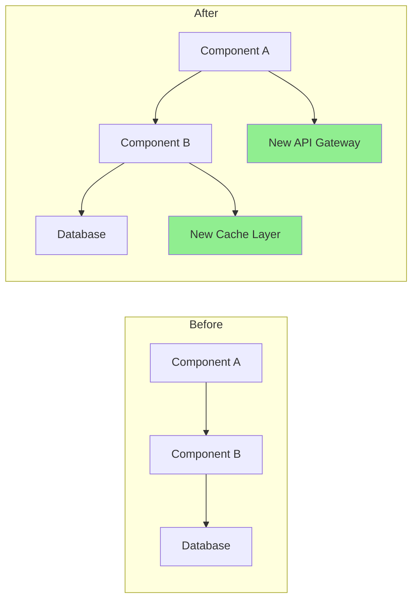

# Pull Request Enhancement

Generate high-quality pull requests that facilitate efficient code reviews with comprehensive descriptions, automated review processes, and context-aware best practices.

## Execution Modes

### Basic Mode (5-10 min)
Simple PR description generation:
- Git diff analysis and change categorization
- Executive summary with statistics
- Change list grouped by category
- Basic review checklist
- Use when: small PRs, quick updates, documentation changes

### Enhanced Mode (10-20 min) - DEFAULT
Full PR description with automation:
- All basic mode content
- Automated code review checks (console logs, large functions, security issues)
- Risk assessment with mitigation strategies
- Context-aware review checklist
- PR size recommendations
- Use when: feature PRs, bug fixes, standard development

### Enterprise Mode (20-40 min)
Complete PR optimization:
- All enhanced mode content
- Test coverage comparison (before/after)
- Visual architecture diagrams (Mermaid)
- PR split suggestions for large changes
- Review response templates
- Framework-specific analysis
- Use when: major features, architectural changes, high-risk deployments

**To select mode**: Use `--mode=basic|enhanced|enterprise` flag. Default: enhanced.

## Context

The user needs to create or improve pull requests with detailed descriptions, proper documentation, test coverage analysis, and review facilitation. Focus on making PRs that are easy to review, well-documented, and include all necessary context.

## Requirements
$ARGUMENTS

---

## 1. PR Analysis & Change Detection

Analyze git changes and generate insights:

### Change Summary Generator

```python
import subprocess
import re
from collections import defaultdict

class PRAnalyzer:
    """Analyze PR changes and generate comprehensive insights"""

    def analyze_changes(self, base_branch='main'):
        """Analyze changes between current branch and base"""
        analysis = {
            'files_changed': self._get_changed_files(base_branch),
            'change_statistics': self._get_change_stats(base_branch),
            'change_categories': self._categorize_changes(base_branch),
            'potential_impacts': self._assess_impacts(base_branch),
            'dependencies_affected': self._check_dependencies(base_branch)
        }
        return analysis

    def _get_changed_files(self, base_branch):
        """Get list of changed files with statistics"""
        cmd = f"git diff --name-status {base_branch}...HEAD"
        result = subprocess.run(cmd.split(), capture_output=True, text=True)

        files = []
        for line in result.stdout.strip().split('\n'):
            if line:
                status, filename = line.split('\t', 1)
                files.append({
                    'filename': filename,
                    'status': self._parse_status(status),
                    'category': self._categorize_file(filename)
                })
        return files

    def _get_change_stats(self, base_branch):
        """Get detailed change statistics"""
        cmd = f"git diff --shortstat {base_branch}...HEAD"
        result = subprocess.run(cmd.split(), capture_output=True, text=True)

        # Parse: "10 files changed, 450 insertions(+), 123 deletions(-)"
        stats_pattern = r'(\d+) files? changed(?:, (\d+) insertions?\(\+\))?(?:, (\d+) deletions?\(-\))?'
        match = re.search(stats_pattern, result.stdout)

        if match:
            files, insertions, deletions = match.groups()
            return {
                'files_changed': int(files),
                'insertions': int(insertions or 0),
                'deletions': int(deletions or 0),
                'net_change': int(insertions or 0) - int(deletions or 0)
            }
        return {'files_changed': 0, 'insertions': 0, 'deletions': 0, 'net_change': 0}

    def _categorize_file(self, filename):
        """Categorize file by type"""
        categories = {
            'source': ['.js', '.ts', '.py', '.java', '.go', '.rs'],
            'test': ['test', 'spec', '.test.', '.spec.'],
            'config': ['config', '.json', '.yml', '.yaml', '.toml'],
            'docs': ['.md', 'README', 'CHANGELOG', '.rst'],
            'styles': ['.css', '.scss', '.less'],
            'build': ['Makefile', 'Dockerfile', '.gradle', 'pom.xml']
        }

        for category, patterns in categories.items():
            if any(pattern in filename for pattern in patterns):
                return category
        return 'other'
```

**Usage**: Instantiate `PRAnalyzer()` and call `.analyze_changes()` to get comprehensive change analysis.

---

## 2. PR Description Generation

Create comprehensive PR descriptions using analysis data:

### Description Template Generator

```python
def generate_pr_description(analysis, commits):
    """Generate detailed PR description from analysis"""
    description = f"""
## Summary

{generate_summary(analysis, commits)}

## What Changed

{generate_change_list(analysis)}

## Why These Changes

{extract_why_from_commits(commits)}

## Type of Change

{determine_change_types(analysis)}

## How Has This Been Tested?

{generate_test_section(analysis)}

## Breaking Changes

{identify_breaking_changes(analysis)}

## Dependencies

{list_dependency_changes(analysis)}

## Checklist

{generate_review_checklist(analysis)}
"""
    return description

def generate_summary(analysis, commits):
    """Generate executive summary"""
    stats = analysis['change_statistics']
    main_purpose = extract_main_purpose(commits)

    summary = f"""
This PR {main_purpose}.

**Impact**: {stats['files_changed']} files changed ({stats['insertions']} additions, {stats['deletions']} deletions)
**Risk Level**: {calculate_risk_level(analysis)}
**Review Time**: ~{estimate_review_time(stats)} minutes
"""
    return summary

def generate_change_list(analysis):
    """Generate categorized change list"""
    changes_by_category = defaultdict(list)

    for file in analysis['files_changed']:
        changes_by_category[file['category']].append(file)

    change_list = ""
    icons = {
        'source': '🔧', 'test': '✅', 'docs': '📝',
        'config': '⚙️', 'styles': '🎨', 'build': '🏗️', 'other': '📁'
    }

    for category, files in changes_by_category.items():
        change_list += f"\n### {icons.get(category, '📁')} {category.title()} Changes\n"
        for file in files[:10]:
            change_list += f"- {file['status']}: `{file['filename']}`\n"
        if len(files) > 10:
            change_list += f"- ...and {len(files) - 10} more\n"

    return change_list
```

**Reference**: See `pr-templates-library.md` for 8 comprehensive PR templates (feature, bugfix, refactor, performance, security, docs, dependency, config).

---

## 3. Review Checklist Generation

Create context-aware automated review checklists:

### Smart Checklist Generator

```python
def generate_review_checklist(analysis):
    """Generate context-aware review checklist based on changed files"""
    checklist = ["## Review Checklist\n"]

    # General items
    general_items = [
        "Code follows project style guidelines",
        "Self-review completed",
        "Comments added for complex logic",
        "No debugging code left",
        "No sensitive data exposed"
    ]

    checklist.append("### General")
    for item in general_items:
        checklist.append(f"- [ ] {item}")

    # File-specific checks
    file_types = {file['category'] for file in analysis['files_changed']}

    if 'source' in file_types:
        checklist.append("\n### Code Quality")
        checklist.extend([
            "- [ ] No code duplication",
            "- [ ] Functions are focused and small",
            "- [ ] Variable names are descriptive",
            "- [ ] Error handling is comprehensive",
            "- [ ] No performance bottlenecks introduced"
        ])

    if 'test' in file_types:
        checklist.append("\n### Testing")
        checklist.extend([
            "- [ ] All new code is covered by tests",
            "- [ ] Tests are meaningful (not just for coverage)",
            "- [ ] Edge cases are tested",
            "- [ ] Tests follow AAA pattern (Arrange, Act, Assert)",
            "- [ ] No flaky tests introduced"
        ])

    if 'config' in file_types:
        checklist.append("\n### Configuration")
        checklist.extend([
            "- [ ] No hardcoded values",
            "- [ ] Environment variables documented",
            "- [ ] Backwards compatibility maintained",
            "- [ ] Security implications reviewed"
        ])

    if has_security_implications(analysis):
        checklist.append("\n### Security")
        checklist.extend([
            "- [ ] No SQL injection vulnerabilities",
            "- [ ] Input validation implemented",
            "- [ ] Authentication/authorization correct",
            "- [ ] No sensitive data in logs",
            "- [ ] Dependencies are secure"
        ])

    return '\n'.join(checklist)
```

**Reference**: See `review-best-practices.md` for comprehensive review checklists (general, framework-specific, security, performance).

---

## 4. Automated Code Review Checks

Perform automated quality checks on PR diff:

### Automated Review Bot

```python
class ReviewBot:
    """Automated code review checks for common issues"""

    def perform_automated_checks(self, pr_diff):
        """Run all automated checks on PR diff"""
        findings = []

        checks = [
            self._check_console_logs,
            self._check_commented_code,
            self._check_large_functions,
            self._check_todo_comments,
            self._check_hardcoded_values,
            self._check_missing_error_handling,
            self._check_security_issues
        ]

        for check in checks:
            findings.extend(check(pr_diff))

        return findings

    def _check_console_logs(self, diff):
        """Detect console.log statements"""
        findings = []
        pattern = r'\+.*console\.(log|debug|info|warn|error)'

        for file, content in diff.items():
            matches = re.finditer(pattern, content, re.MULTILINE)
            for match in matches:
                findings.append({
                    'type': 'warning',
                    'file': file,
                    'line': self._get_line_number(match, content),
                    'message': 'Console statement found - remove before merging',
                    'suggestion': 'Use proper logging framework instead'
                })
        return findings

    def _check_large_functions(self, diff):
        """Detect functions exceeding size thresholds"""
        findings = []

        for file, content in diff.items():
            if file.endswith(('.js', '.ts', '.py')):
                functions = self._extract_functions(content)
                for func in functions:
                    if func['lines'] > 50:
                        findings.append({
                            'type': 'suggestion',
                            'file': file,
                            'line': func['start_line'],
                            'message': f"Function '{func['name']}' is {func['lines']} lines long",
                            'suggestion': 'Consider breaking into smaller functions'
                        })
        return findings

    def _check_security_issues(self, diff):
        """Detect common security vulnerabilities"""
        findings = []
        security_patterns = {
            'sql_injection': r'execute\(.*\+.*\)',
            'xss': r'innerHTML\s*=',
            'hardcoded_secret': r'(password|api_key|secret)\s*=\s*["\'][^"\']+["\']'
        }

        for pattern_name, pattern in security_patterns.items():
            for file, content in diff.items():
                matches = re.finditer(pattern, content, re.IGNORECASE)
                for match in matches:
                    findings.append({
                        'type': 'critical',
                        'file': file,
                        'line': self._get_line_number(match, content),
                        'message': f'Potential {pattern_name.replace("_", " ")} vulnerability',
                        'suggestion': 'Review and sanitize inputs or use parameterized queries'
                    })
        return findings
```

**Note**: Enhanced and Enterprise modes include automated review bot results.

---

## 5. Risk Assessment

Calculate and present PR risk score:

### Risk Calculator

```python
def calculate_pr_risk(analysis):
    """Calculate comprehensive risk score for PR"""
    risk_factors = {
        'size': calculate_size_risk(analysis),
        'complexity': calculate_complexity_risk(analysis),
        'test_coverage': calculate_test_risk(analysis),
        'dependencies': calculate_dependency_risk(analysis),
        'security': calculate_security_risk(analysis)
    }

    overall_risk = sum(risk_factors.values()) / len(risk_factors)

    risk_report = f"""
## Risk Assessment

**Overall Risk Level**: {get_risk_level(overall_risk)} ({overall_risk:.1f}/10)

### Risk Factors

| Factor | Score | Details |
|--------|-------|---------|
| Size | {risk_factors['size']:.1f}/10 | {get_size_details(analysis)} |
| Complexity | {risk_factors['complexity']:.1f}/10 | {get_complexity_details(analysis)} |
| Test Coverage | {risk_factors['test_coverage']:.1f}/10 | {get_test_details(analysis)} |
| Dependencies | {risk_factors['dependencies']:.1f}/10 | {get_dependency_details(analysis)} |
| Security | {risk_factors['security']:.1f}/10 | {get_security_details(analysis)} |

### Mitigation Strategies

{generate_mitigation_strategies(risk_factors)}
"""
    return risk_report

def get_risk_level(score):
    """Convert numerical score to risk level"""
    if score < 2.5:
        return "🟢 Low"
    elif score < 5.0:
        return "🟡 Medium"
    elif score < 7.5:
        return "🟠 High"
    else:
        return "🔴 Critical"
```

**Reference**: See `risk-assessment-framework.md` for detailed risk scoring algorithms, formulas, thresholds, and mitigation strategies for each risk level.

---

## 6. PR Size Optimization

Detect large PRs and suggest logical splits:

### PR Splitter

```python
def suggest_pr_splits(analysis):
    """Suggest how to split large PRs into reviewable units"""
    stats = analysis['change_statistics']

    # Threshold: 20+ files or 1000+ total changes
    if stats['files_changed'] > 20 or stats['insertions'] + stats['deletions'] > 1000:
        suggestions = analyze_split_opportunities(analysis)

        return f"""
## ⚠️ Large PR Detected

This PR changes {stats['files_changed']} files with {stats['insertions'] + stats['deletions']} total changes.
Large PRs are harder to review and more likely to introduce bugs.

### Suggested Splits:

{format_split_suggestions(suggestions)}

### How to Split:

```bash
# Create feature branches for each logical unit
git checkout -b feature/part-1
git cherry-pick <commit-hashes-for-part-1>
git push origin feature/part-1

git checkout -b feature/part-2
git cherry-pick <commit-hashes-for-part-2>
git push origin feature/part-2
```
"""
    return ""

def analyze_split_opportunities(analysis):
    """Find logical units for splitting based on feature areas"""
    suggestions = []
    feature_groups = defaultdict(list)

    for file in analysis['files_changed']:
        feature = extract_feature_area(file['filename'])
        feature_groups[feature].append(file)

    for feature, files in feature_groups.items():
        if len(files) >= 5:
            suggestions.append({
                'name': f"{feature} changes",
                'files': files,
                'reason': f"Isolated changes to {feature} feature"
            })

    return suggestions
```

**Best Practice**: PRs with > 400 lines of changes should be split for better reviewability.

---

## 7. Visual Diff Enhancement (Enterprise Mode)

Generate architecture diagrams showing changes:

### Mermaid Diagram Generator

```python
def generate_architecture_diff(analysis):
    """Generate Mermaid diagram showing architectural changes"""
    if has_architectural_changes(analysis):
        return f"""
## Architecture Changes



### Key Changes:
1. Added caching layer for performance
2. Introduced API gateway for better routing
3. Refactored component communication
"""
    return ""
```

**Note**: Generate visual diagrams for architectural changes, data flow modifications, or new component introductions.

---

## 8. Test Coverage Report (Enterprise Mode)

Compare test coverage before and after PR:

### Coverage Report Generator

```python
def generate_coverage_report(base_branch='main'):
    """Generate test coverage comparison (before/after)"""
    before_coverage = get_coverage_for_branch(base_branch)
    after_coverage = get_coverage_for_branch('HEAD')
    coverage_diff = after_coverage - before_coverage

    report = f"""
## Test Coverage

| Metric | Before | After | Change |
|--------|--------|-------|--------|
| Lines | {before_coverage['lines']:.1f}% | {after_coverage['lines']:.1f}% | {format_diff(coverage_diff['lines'])} |
| Functions | {before_coverage['functions']:.1f}% | {after_coverage['functions']:.1f}% | {format_diff(coverage_diff['functions'])} |
| Branches | {before_coverage['branches']:.1f}% | {after_coverage['branches']:.1f}% | {format_diff(coverage_diff['branches'])} |

### Uncovered Files
"""

    for file in get_low_coverage_files():
        report += f"- `{file['name']}`: {file['coverage']:.1f}% coverage\n"

    return report

def format_diff(value):
    """Format coverage difference with visual indicators"""
    if value > 0:
        return f"<span style='color: green'>+{value:.1f}%</span> ✅"
    elif value < 0:
        return f"<span style='color: red'>{value:.1f}%</span> ⚠️"
    else:
        return "No change"
```

**Requirement**: Coverage should not decrease. Ideally, new code has 80%+ coverage for features, 90%+ for bug fixes.

---

## 9. PR Template Selection

Select appropriate template based on change type:

### Template Selector

**Available Templates** (see `pr-templates-library.md` for full templates):

1. **Feature Addition**: User stories, acceptance criteria, technical implementation
2. **Bug Fix**: Root cause analysis, reproduction steps, verification
3. **Refactoring**: Motivation, code quality metrics, compatibility checklist
4. **Performance Optimization**: Benchmarks, profiling results, trade-offs
5. **Security Fix**: CVSS scoring, vulnerability details, mitigation
6. **Documentation Update**: What changed, target audience, accuracy checklist
7. **Dependency Update**: Security vulnerabilities, breaking changes, testing
8. **Configuration Change**: Environment variables, deployment instructions, rollback plan

**Selection Logic**:
```python
def select_pr_template(analysis):
    """Auto-select appropriate PR template"""
    if contains_security_fixes(analysis):
        return 'security'
    elif contains_performance_changes(analysis):
        return 'performance'
    elif is_bug_fix(analysis):
        return 'bugfix'
    elif is_refactoring(analysis):
        return 'refactor'
    elif has_new_features(analysis):
        return 'feature'
    elif is_docs_only(analysis):
        return 'documentation'
    elif has_dependency_updates(analysis):
        return 'dependency'
    elif is_config_change(analysis):
        return 'configuration'
    else:
        return 'feature'  # default
```

**Reference**: See `pr-templates-library.md` for complete template library with 8 detailed templates.

---

## 10. Review Response Templates (Enterprise Mode)

Pre-written responses for common review scenarios:

### Response Templates

```python
review_response_templates = {
    'acknowledge_feedback': """
Thank you for the thorough review! I'll address these points.
""",

    'explain_decision': """
Great question! I chose this approach because:
1. [Reason 1]
2. [Reason 2]

Alternatives considered:
- [Alternative 1]: [Why not chosen]
- [Alternative 2]: [Why not chosen]

Happy to discuss further if you have concerns.
""",

    'request_clarification': """
Thanks for the feedback. Could you clarify what you mean by [specific point]?
I want to make sure I understand your concern correctly.
""",

    'disagree_respectfully': """
I appreciate your perspective. I have a slightly different view:

[Your reasoning]

However, I'm open to discussion. What do you think about [compromise]?
""",

    'commit_to_change': """
Good catch! I'll update this to [specific change].
This should address [concern] while maintaining [other requirement].
"""
}
```

**Reference**: See `review-best-practices.md` for communication guidelines and response best practices.

---

## Output Format by Mode

### Basic Mode Output
1. PR Summary (executive summary with key metrics)
2. Detailed Description (comprehensive PR description)
3. Review Checklist (context-aware items)

### Enhanced Mode Output (Basic +)
4. Automated Review Findings (console logs, large functions, security)
5. Risk Assessment (risk score with mitigation strategies)
6. Size Recommendations (split suggestions for large PRs)

### Enterprise Mode Output (Enhanced +)
7. Test Coverage Report (before/after comparison)
8. Visual Architecture Diagrams (Mermaid)
9. PR Template Selection (auto-select appropriate template)
10. Review Response Templates (pre-written responses)

---

## Workflow Integration

### GitHub CLI Integration

```bash
# Generate PR description
claude "/pr-enhance --mode=enhanced"

# Create PR with generated description
gh pr create --title "Feature: User Authentication" \
  --body "$(cat pr-description.md)"

# Request reviews based on risk level
if [ $RISK_LEVEL == "High" ]; then
  gh pr edit --add-reviewer security-team,tech-lead
fi
```

### CI/CD Integration

Add automated PR analysis to GitHub Actions:
```yaml
name: PR Analysis
on: [pull_request]
jobs:
  analyze:
    runs-on: ubuntu-latest
    steps:
      - name: Analyze PR
        run: |
          python analyze_pr.py > pr-analysis.md
          gh pr comment --body-file pr-analysis.md
```

---

**Focus**: Create PRs that are a pleasure to review with all necessary context, documentation, and automation for efficient code review processes.

**External Documentation**:
- `docs/comprehensive-review/pr-templates-library.md` - 8 comprehensive PR templates
- `docs/comprehensive-review/review-best-practices.md` - Review checklists and communication guidelines
- `docs/comprehensive-review/risk-assessment-framework.md` - Risk scoring algorithms and mitigation strategies
