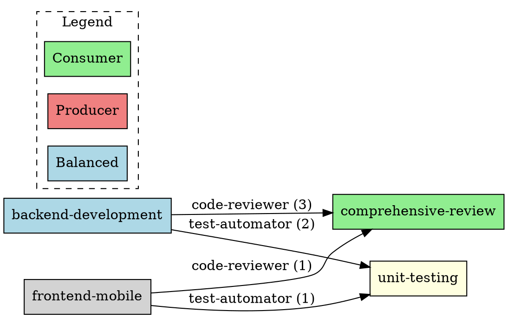

# Dependency Analysis Guide

Comprehensive guide to analyzing cross-plugin dependencies, detecting circular dependencies, and visualizing plugin architecture.

## Overview

Understanding plugin dependencies is critical for:
- Architecture planning and refactoring
- Detecting circular dependencies
- Identifying unused agents
- Optimizing plugin structure
- Planning breaking changes

---

## 1. Cross-Plugin Dependency Detection

### What Are Cross-Plugin Dependencies?

Cross-plugin dependencies occur when a plugin's commands or agents reference agents from other plugins.

**Example**:
```markdown
<!-- plugins/backend-development/commands/api-design.md -->
agents:
  - backend-development:backend-architect    # Same plugin
  - comprehensive-review:code-reviewer       # Cross-plugin dependency
  - unit-testing:test-automator             # Cross-plugin dependency
```

**Dependency graph**:
```
backend-development → comprehensive-review (code-reviewer)
backend-development → unit-testing (test-automator)
```

### Running Dependency Analysis

```bash
# Analyze all plugins
/lint-plugins --analyze-deps

# Analyze specific plugin
/lint-plugins --plugin=backend-development --analyze-deps

# Generate detailed report
/lint-plugins --analyze-deps --report
```

### Output Format

```
================================================================================
CROSS-PLUGIN DEPENDENCY ANALYSIS
================================================================================

📊 Summary:
  Total plugins: 17
  Plugins with dependencies: 12
  Cross-plugin references: 89
  Circular dependencies: 0

────────────────────────────────────────────────────────────────────────────
DEPENDENCY GRAPH
────────────────────────────────────────────────────────────────────────────

backend-development
├─ Uses: comprehensive-review:code-reviewer (3 references)
│  └─ commands/api-design.md:12
│  └─ commands/feature-development.md:18
│  └─ commands/optimize-queries.md:25
├─ Uses: unit-testing:test-automator (2 references)
│  └─ commands/api-design.md:13
│  └─ commands/feature-development.md:19
└─ Uses: full-stack-orchestration:deployment-engineer (1 reference)
   └─ commands/production-deploy.md:30

custom-commands
├─ Uses: debugging-toolkit:debugger (5 references)
│  └─ commands/smart-fix.md:15
│  └─ commands/auto-debug.md:22
│  └─ commands/incident-response.md:18
│  └─ commands/performance-tune.md:28
│  └─ commands/root-cause.md:35
└─ Uses: comprehensive-review:code-reviewer (2 references)
   └─ commands/pr-review.md:20
   └─ commands/code-quality.md:25

frontend-mobile-development
├─ Uses: comprehensive-review:code-reviewer (1 reference)
│  └─ commands/component-scaffold.md:15
└─ Uses: unit-testing:test-automator (1 reference)
   └─ commands/component-scaffold.md:16

────────────────────────────────────────────────────────────────────────────
MOST USED AGENTS (Cross-Plugin)
────────────────────────────────────────────────────────────────────────────

  1. comprehensive-review:code-reviewer       (15 references from 8 plugins)
  2. unit-testing:test-automator              (12 references from 6 plugins)
  3. debugging-toolkit:debugger               (8 references from 4 plugins)
  4. full-stack-orchestration:performance-engineer (6 references from 3 plugins)
  5. backend-development:backend-architect    (5 references from 3 plugins)

────────────────────────────────────────────────────────────────────────────
DEPENDENCY COUPLING METRICS
────────────────────────────────────────────────────────────────────────────

  Plugin                          | Outgoing Deps | Incoming Deps | Coupling
  --------------------------------|---------------|---------------|----------
  comprehensive-review            |       0       |      15       | Consumer
  unit-testing                    |       2       |      12       | Balanced
  debugging-toolkit               |       1       |       8       | Balanced
  backend-development             |       5       |       5       | Balanced
  custom-commands                 |      12       |       0       | Producer
  full-stack-orchestration        |       8       |       6       | Balanced
  frontend-mobile-development     |       4       |       1       | Producer

  Legend:
    - Consumer: Provides agents, low dependencies (stable, reusable)
    - Producer: Uses many agents, few dependents (complex, coupled)
    - Balanced: Moderate dependencies both ways
```

---

## 2. Circular Dependency Detection

### What Are Circular Dependencies?

Circular dependencies occur when plugins reference each other in a cycle:

```
Plugin A → Plugin B → Plugin C → Plugin A
```

**Why this matters**:
- Can cause infinite loops in agent orchestration
- Makes plugins harder to maintain independently
- Indicates poor separation of concerns

### Detection Algorithm

The linter uses depth-first search (DFS) to detect cycles:

```python
def detect_circular_dependencies(graph):
    visited = set()
    rec_stack = set()
    cycles = []

    def dfs(node, path):
        visited.add(node)
        rec_stack.add(node)

        for neighbor in graph.get(node, []):
            if neighbor not in visited:
                if dfs(neighbor, path + [neighbor]):
                    return True
            elif neighbor in rec_stack:
                # Cycle detected
                cycle_start = path.index(neighbor)
                cycles.append(path[cycle_start:] + [neighbor])
                return True

        rec_stack.remove(node)
        return False

    for node in graph:
        if node not in visited:
            dfs(node, [node])

    return cycles
```

### Example: Circular Dependency Detected

```
❌ CIRCULAR DEPENDENCY DETECTED

Cycle 1:
  plugin-a → plugin-b → plugin-c → plugin-a

Details:
  plugin-a:commands/workflow.md:15 → plugin-b:agent-x
  plugin-b:commands/process.md:22 → plugin-c:agent-y
  plugin-c:commands/helper.md:18 → plugin-a:agent-z

💡 Recommendation:
  Break the cycle by:
  1. Moving shared agents to a common plugin
  2. Removing unnecessary cross-references
  3. Restructuring plugin boundaries
```

### Resolution Strategies

#### Strategy 1: Extract Common Plugin

**Before** (circular):
```
plugin-a → plugin-b → plugin-a
```

**After** (no cycle):
```
plugin-a → shared-plugin
plugin-b → shared-plugin
```

Create `shared-plugin` with common agents:
```
plugins/shared-plugin/
├── plugin.json
└── agents/
    └── common-agent.md
```

#### Strategy 2: Inline Agent

If dependency is minimal, inline the agent instead of referencing:

**Before**:
```markdown
<!-- plugin-a/commands/workflow.md -->
agents:
  - plugin-b:small-helper
```

**After**:
```markdown
<!-- plugin-a/commands/workflow.md -->
# Inline helper logic instead of referencing plugin-b
```

#### Strategy 3: Restructure Boundaries

Re-evaluate plugin responsibilities and move agents accordingly.

---

## 3. Unused Agent Identification

### What Are Unused Agents?

Agents that exist in a plugin but are never referenced in any command or by other plugins.

### Detection

```bash
/lint-plugins --analyze-deps --find-unused
```

**Output**:
```
────────────────────────────────────────────────────────────────────────────
UNUSED AGENTS
────────────────────────────────────────────────────────────────────────────

⚠️  The following agents are never referenced:

  backend-development:legacy-adapter
  └─ File: plugins/backend-development/agents/legacy-adapter.md
  └─ Last modified: 2024-06-15
  └─ Lines: 145

  data-engineering:deprecated-transformer
  └─ File: plugins/data-engineering/agents/deprecated-transformer.md
  └─ Last modified: 2024-03-20
  └─ Lines: 203

💡 Recommendations:
  1. Remove unused agents to reduce maintenance burden
  2. Archive agents if they may be needed later
  3. Document why agents exist if intentionally unused
```

### Actions for Unused Agents

**Option 1: Remove**
```bash
# Remove agent file
rm plugins/backend-development/agents/legacy-adapter.md

# Remove from plugin.json
jq 'del(.agents[] | select(.name == "legacy-adapter"))' plugin.json > tmp.json
mv tmp.json plugin.json
```

**Option 2: Archive**
```bash
# Move to archive directory
mkdir -p plugins/backend-development/archive/agents
mv plugins/backend-development/agents/legacy-adapter.md \
   plugins/backend-development/archive/agents/
```

**Option 3: Document**
```markdown
<!-- agents/legacy-adapter.md -->
---
status: inactive
reason: Reserved for future use
---

# Legacy Adapter

⚠️ This agent is currently inactive but reserved for future migration workflows.
```

---

## 4. Dependency Graph Visualization

### Generate Dependency Graph

```bash
# Generate DOT format graph
/lint-plugins --analyze-deps --output-graph deps.dot

# Convert to image
dot -Tpng deps.dot -o deps.png

# Or SVG for web
dot -Tsvg deps.dot -o deps.svg
```

### DOT File Format



### Visualization Tools

**Graphviz**:
```bash
# Install
brew install graphviz  # macOS
sudo apt install graphviz  # Ubuntu

# Generate PNG
dot -Tpng deps.dot -o deps.png

# Generate SVG
dot -Tsvg deps.dot -o deps.svg

# Interactive layout
fdp -Tpng deps.dot -o deps-fdp.png
```

**Online Viewers**:
- [GraphvizOnline](https://dreampuf.github.io/GraphvizOnline/)
- [Viz.js](http://viz-js.com/)

### Example Visualization

```
┌─────────────────────────────────────────────────────────────┐
│                 Plugin Dependency Graph                      │
└─────────────────────────────────────────────────────────────┘

   ┌──────────────────┐
   │ comprehensive-   │◄──────────────┐
   │    review        │               │
   └──────────────────┘               │
         ▲                            │
         │ code-reviewer (15×)        │
         │                            │
   ┌─────┴──────────┐           ┌────┴──────────┐
   │    backend-    │           │   frontend-   │
   │  development   │           │    mobile     │
   └────────────────┘           └───────────────┘
         │                            │
         │ test-automator (12×)       │
         │                            │
         ▼                            ▼
   ┌──────────────────┐         ┌────────────────┐
   │  unit-testing    │         │   debugging-   │
   └──────────────────┘         │    toolkit     │
                                └────────────────┘
```

---

## 5. Architecture Review Use Cases

### Use Case 1: Pre-Refactoring Analysis

**Scenario**: Planning to split `backend-development` into smaller plugins

**Analysis**:
```bash
# Identify all dependencies
/lint-plugins --plugin=backend-development --analyze-deps

# Check what other plugins depend on it
/lint-plugins --analyze-deps --dependents backend-development
```

**Output**:
```
Plugins depending on backend-development:
  - custom-commands (3 agents)
  - full-stack-orchestration (2 agents)
  - data-engineering (1 agent)

Agents used from backend-development:
  - backend-architect (5 references)
  - api-specialist (2 references)
  - database-expert (1 reference)

💡 Refactoring Impact:
  If you split backend-development, 3 other plugins will be affected.
  Most-used agent: backend-architect (consider keeping in core plugin)
```

### Use Case 2: Plugin Coupling Metrics

**Scenario**: Measure plugin independence

**Metrics**:
```
Efferent Coupling (Ce): Number of dependencies on other plugins
Afferent Coupling (Ca): Number of plugins depending on this plugin

Instability (I) = Ce / (Ce + Ca)
  - I = 0: Maximally stable (only depended upon)
  - I = 1: Maximally unstable (only depends on others)

Abstractness (A) = Abstract agents / Total agents
  - A = 0: Concrete (implementation-focused)
  - A = 1: Abstract (interface-focused)
```

**Example**:
```
Plugin: comprehensive-review
  Ce = 0 (no dependencies)
  Ca = 15 (used by 15 other plugins)
  I = 0 / (0 + 15) = 0.00  ← Stable

Plugin: custom-commands
  Ce = 12 (depends on 12 other plugins)
  Ca = 0 (no one depends on it)
  I = 12 / (12 + 0) = 1.00  ← Unstable

💡 Interpretation:
  - comprehensive-review is stable (good for core functionality)
  - custom-commands is unstable (acceptable for high-level workflows)
```

### Use Case 3: Breaking Change Impact

**Scenario**: Planning breaking change in `comprehensive-review:code-reviewer`

**Impact analysis**:
```bash
/lint-plugins --analyze-deps --impact comprehensive-review:code-reviewer
```

**Output**:
```
────────────────────────────────────────────────────────────────────────────
IMPACT ANALYSIS: comprehensive-review:code-reviewer
────────────────────────────────────────────────────────────────────────────

⚠️  Breaking change will affect 15 references across 8 plugins:

  backend-development (3 references)
  ├─ commands/api-design.md:12
  ├─ commands/feature-development.md:18
  └─ commands/optimize-queries.md:25

  custom-commands (2 references)
  ├─ commands/pr-review.md:20
  └─ commands/code-quality.md:25

  frontend-mobile-development (1 reference)
  └─ commands/component-scaffold.md:15

  ... (5 more plugins)

📋 Migration Checklist:
  1. Create migration guide
  2. Add deprecation warnings in v1.x
  3. Release breaking change in v1.0.2
  4. Update all 15 references
  5. Test each affected plugin
  6. Coordinate release with plugin owners

Estimated effort: 2-4 hours
```

---

## 6. Best Practices

### Dependency Management

1. **Minimize cross-plugin dependencies**: Keep plugins focused and self-contained
2. **Use stable plugins as dependencies**: Depend on `comprehensive-review` (stable) rather than `custom-commands` (unstable)
3. **Avoid circular dependencies**: Restructure if detected
4. **Document dependencies**: List required plugins in plugin.json
5. **Version constraints**: Specify minimum versions for dependencies

**Example plugin.json**:
```json
{
  "name": "my-plugin",
  "version": "1.0.0",
  "dependencies": {
    "comprehensive-review": ">=1.0.0",
    "unit-testing": ">=1.0.0"
  }
}
```

### Regular Analysis

**Weekly**: Check for unused agents
```bash
/lint-plugins --analyze-deps --find-unused
```

**Monthly**: Review dependency graph
```bash
/lint-plugins --analyze-deps --output-graph deps.dot
dot -Tpng deps.dot -o deps.png
# Review visualization
```

**Quarterly**: Architecture review
```bash
/lint-plugins --analyze-deps --report --coupling-metrics
# Review coupling metrics
# Plan refactoring if needed
```

---

## 7. Troubleshooting

### Issue: Graph generation fails

**Error**: `dot: command not found`

**Solution**:
```bash
# Install Graphviz
brew install graphviz  # macOS
sudo apt install graphviz  # Ubuntu
```

### Issue: Dependency analysis slow

**Cause**: Scanning many plugins/files

**Solution**:
```bash
# Analyze specific plugin only
/lint-plugins --plugin=my-plugin --analyze-deps

# Cache results
/lint-plugins --analyze-deps --cache
```

### Issue: False positive circular dependency

**Cause**: Conditional dependencies not recognized

**Solution**: Document conditional dependencies in plugin.json:
```json
{
  "dependencies": {
    "comprehensive-review": {
      "version": ">=1.0.0",
      "optional": true,
      "condition": "pattern 'review|quality'"
    }
  }
}
```

---

## Summary

**Quick Commands**:
```bash
# Basic dependency analysis
/lint-plugins --analyze-deps

# Find unused agents
/lint-plugins --analyze-deps --find-unused

# Generate dependency graph
/lint-plugins --analyze-deps --output-graph deps.dot
dot -Tpng deps.dot -o deps.png

# Impact analysis for breaking change
/lint-plugins --analyze-deps --impact plugin:agent

# Coupling metrics
/lint-plugins --analyze-deps --coupling-metrics
```

**Key Metrics**:
- Cross-plugin dependency count
- Circular dependency detection
- Unused agent identification
- Coupling metrics (efferent/afferent)
- Breaking change impact

**Use Cases**:
- Pre-refactoring planning
- Architecture review
- Breaking change assessment
- Plugin health monitoring
- Dependency optimization

---

This guide provides comprehensive tools for understanding and optimizing plugin architecture through dependency analysis.
