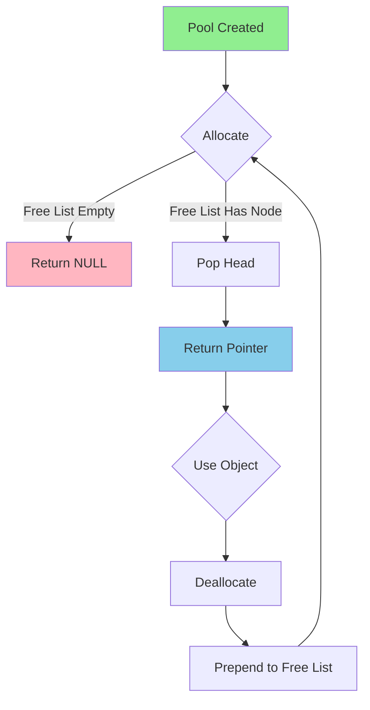

# Memory Pool Internal Structure

## Concept

A memory pool pre-allocates a fixed number of same-sized blocks and manages them via a free list for O(1) allocation and deallocation.

## ASCII Diagram - Intrusive Free List

```
Memory Pool Layout (Capacity: 5 blocks, Block Size: 64 bytes)

Initial State (All Free):
┌─────────────────────────────────────────────────────────────┐
│  Pool Memory (5 × 64 = 320 bytes)                           │
└─────────────────────────────────────────────────────────────┘

Detailed View:
┌────────────┬────────────┬────────────┬────────────┬────────────┐
│  Block 0   │  Block 1   │  Block 2   │  Block 3   │  Block 4   │
│  [next: 1] │  [next: 2] │  [next: 3] │  [next: 4] │  [next: ⊥] │
└────────────┴────────────┴────────────┴────────────┴────────────┘
 ↑
free_list (points to Block 0)

After Allocating Block 0:
┌────────────┬────────────┬────────────┬────────────┬────────────┐
│  Block 0   │  Block 1   │  Block 2   │  Block 3   │  Block 4   │
│  [in use]  │  [next: 2] │  [next: 3] │  [next: 4] │  [next: ⊥] │
└────────────┴────────────┴────────────┴────────────┴────────────┘
              ↑
         free_list (now points to Block 1)

After Allocating Blocks 0, 1, 2:
┌────────────┬────────────┬────────────┬────────────┬────────────┐
│  Block 0   │  Block 1   │  Block 2   │  Block 3   │  Block 4   │
│  [in use]  │  [in use]  │  [in use]  │  [next: 4] │  [next: ⊥] │
└────────────┴────────────┴────────────┴────────────┴────────────┘
                                        ↑
                                   free_list

After Freeing Block 1:
┌────────────┬────────────┬────────────┬────────────┬────────────┐
│  Block 0   │  Block 1   │  Block 2   │  Block 3   │  Block 4   │
│  [in use]  │  [next: 3] │  [in use]  │  [next: 4] │  [next: ⊥] │
└────────────┴────────────┴────────────┴────────────┴────────────┘
              ↑
         free_list (Block 1 prepended to free list)

Free List Structure:
  free_list → Block 1 → Block 3 → Block 4 → NULL
```

## Non-Intrusive Free List (Separate Metadata)

```
Pool Structure:
┌─────────────────────────────────────────┐
│  Pool Metadata                          │
│  - capacity: 5                          │
│  - object_size: 64                      │
│  - allocated: 2                         │
│  - free_indices: [1, 3, 4]              │
└─────────────────────────────────────────┘
        │
        ↓
┌────────────┬────────────┬────────────┬────────────┬────────────┐
│  Block 0   │  Block 1   │  Block 2   │  Block 3   │  Block 4   │
│  [in use]  │  [free]    │  [in use]  │  [free]    │  [free]    │
│  (64 B)    │  (64 B)    │  (64 B)    │  (64 B)    │  (64 B)    │
└────────────┴────────────┴────────────┴────────────┴────────────┘

Free Indices Array:
┌───┬───┬───┬───┬───┐
│ 1 │ 3 │ 4 │   │   │
└───┴───┴───┴───┴───┘
              ↑
         next_free_index
```

## Handle-Based Pool (Rust-style with Generations)

```
Pool with Generational Handles:

Entry Structure:
┌────────────────┬─────────────┬──────────┐
│  Value         │ Generation  │ Next Free│
│  (Option<T>)   │ (u32)       │ (Option) │
└────────────────┴─────────────┴──────────┘

Pool State:
Index │ Value    │ Generation │ Next Free
──────┼──────────┼────────────┼───────────
  0   │ Some(A)  │ 0          │ None
  1   │ None     │ 1          │ Some(3)
  2   │ Some(B)  │ 0          │ None
  3   │ None     │ 0          │ Some(4)
  4   │ None     │ 0          │ None

free_head → 1

Handle Format:
┌───────────┬────────────┐
│  Index: 2 │  Gen: 0    │  ← Valid handle to "B"
└───────────┴────────────┘

Old Handle (after free):
┌───────────┬────────────┐
│  Index: 1 │  Gen: 0    │  ← Invalid (generation mismatch: 0 vs 1)
└───────────┴────────────┘
```

## Cache-Line Alignment

```
Without Alignment (Poor Performance):
┌──────┬──────┬──────┬──────┬──────┬──────┐
│ Obj1 │ Obj2 │ Obj3 │ Obj4 │ Obj5 │ Obj6 │
│ (32B)│ (32B)│ (32B)│ (32B)│ (32B)│ (32B)│
└──────┴──────┴──────┴──────┴──────┴──────┘
Cache Line 0 (64B)   │  Cache Line 1 (64B)
└────────┴────────┬──┴──┬────────┴────────┘
         ↑ False Sharing ↑

With Cache-Line Alignment (64-byte):
┌──────────────┬──────────────┬──────────────┐
│  Object 1    │  Object 2    │  Object 3    │
│  (32B + pad) │  (32B + pad) │  (32B + pad) │
│    (64B)     │    (64B)     │    (64B)     │
└──────────────┴──────────────┴──────────────┘
Cache Line 0    Cache Line 1   Cache Line 2
└─────────────────────────────────────────────┘
         No False Sharing!
```

## Pool Operations

```
Allocation Flow:
┌─────────────┐
│ pool_alloc()│
└──────┬──────┘
       │
       ↓
   ┌────────────────┐
   │ free_list NULL?│
   └───┬────────┬───┘
       │        │
      Yes       No
       │        │
       ↓        ↓
   ┌──────┐  ┌──────────────────┐
   │Return│  │ Pop from free list│
   │ NULL │  │ Return pointer    │
   └──────┘  └──────────────────┘

Deallocation Flow:
┌─────────────┐
│ pool_free() │
└──────┬──────┘
       │
       ↓
   ┌─────────────────┐
   │ Validate pointer│
   └────────┬────────┘
            │
            ↓
   ┌──────────────────┐
   │ Prepend to free  │
   │ list (O(1))      │
   └──────────────────┘
```

## Memory Overhead Comparison

```
Scenario: 10,000 allocations of 64-byte objects

Method          │ Object │ Metadata │ Total   │ Overhead
────────────────┼────────┼──────────┼─────────┼──────────
malloc/free     │ 640 KB │ ~160 KB  │ 800 KB  │ 25%
Pool (intrusive)│ 640 KB │ 0 KB     │ 640 KB  │ 0%
Pool (indices)  │ 640 KB │ 80 KB    │ 720 KB  │ 12.5%
Pool (handles)  │ 640 KB │ 160 KB   │ 800 KB  │ 25%
```

## Performance Characteristics

```
Operation       │ Pool (Free List) │ Pool (Index) │ malloc
────────────────┼──────────────────┼──────────────┼─────────
Allocate        │ O(1)             │ O(1)         │ O(log n)
Deallocate      │ O(1)             │ O(1)         │ O(log n)
Contains check  │ O(1)             │ O(1)         │ N/A
Iteration       │ O(capacity)      │ O(capacity)  │ N/A
```

## Real-World Example: Game Entity Pool

```
Entity Pool (1000 entities, 128 bytes each)

┌──────────────────────────────────────────────────────────────┐
│  Entity Pool Memory (128 KB)                                 │
└──────────────────────────────────────────────────────────────┘

Active Entities:
┌─────────┬─────────┬─────────┬─────────┬     ┬─────────┐
│ Player  │ Enemy 1 │ Enemy 2 │ Bullet 1│ ... │ Item 23 │
│ ID: 0   │ ID: 5   │ ID: 12  │ ID: 47  │     │ ID: 892 │
└─────────┴─────────┴─────────┴─────────┴     ┴─────────┘

Free List (available for new entities):
  free_head → 1 → 2 → 3 → 4 → 6 → 7 → ... → 999 → NULL

Spawn Enemy:
  1. Pop from free list: ID = 1
  2. Initialize enemy at slot 1
  3. O(1) allocation

Enemy Destroyed:
  1. Call destructor
  2. Prepend ID 5 to free list
  3. O(1) deallocation
```

## Fragmentation Comparison

```
Traditional Heap After Mixed Alloc/Free:
┌───┬─┬─────┬───┬──┬────┬─┬───────┬─┬─────────┐
│ A │ │  B  │   │C │  D │ │   E   │ │    F    │
└───┴─┴─────┴───┴──┴────┴─┴───────┴─┴─────────┘
     ↑       ↑      ↑       ↑
   Holes (external fragmentation)

Memory Pool (No Fragmentation):
┌───┬───┬───┬───┬───┬───┬───┬───┬───┬───┐
│ A │ B │ C │ D │ E │ F │   │   │   │   │
└───┴───┴───┴───┴───┴───┴───┴───┴───┴───┘
                         ↑
                    Contiguous free space
```

## Mermaid Diagram Source



## Best Practices

```
✓ Do:
  - Size pool for 95th percentile usage
  - Align objects to cache line boundaries for concurrency
  - Use separate pools for different object types
  - Profile to verify performance improvement

✗ Don't:
  - Mix object sizes in one pool
  - Over-allocate (wastes memory)
  - Under-allocate (leads to exhaustion)
  - Use for objects with wildly varying lifetimes
```
