# Plugin Dependency Map

Cross-plugin dependency analysis for Claude Code marketplace

## Summary

- **Total Plugins:** 22
- **Total References:** 29
- **Plugins with Dependencies:** 5
- **Plugins Referenced:** 10

## Plugins by Category

### Ai Ml (2 plugins)

- `deep-learning`
- `machine-learning`

### Dev Tools (1 plugins)

- `debugging-toolkit`

### Developer Tools (1 plugins)

- `cli-tool-design`

### Development (2 plugins)

- `python-development`
- `systems-programming`

### Scientific Computing (2 plugins)

- `data-visualization`
- `julia-development`

### Uncategorized (14 plugins)

- `agent-orchestration`
- `ai-reasoning`
- `cicd-automation`
- `code-documentation`
- `code-migration`
- `hpc-computing`
- `javascript-typescript`
- `jax-implementation`
- `molecular-simulation`
- `multi-platform-apps`
- `quality-engineering`
- `research-methodology`
- `statistical-physics`
- `unit-testing`

## Dependency Matrix

Plugins listed by number of dependencies (references to other plugins):

**systems-programming** (4 dependencies):
  - `hpc-computing` (documentation)
  - `javascript-typescript` (command)
  - `machine-learning` (documentation)
  - `python-development` (skill)

**julia-development** (3 dependencies):
  - `deep-learning` (documentation, integration)
  - `hpc-computing` (documentation, workflow)
  - `jax-implementation` (documentation)

**multi-platform-apps** (3 dependencies):
  - `code-documentation` (agent)
  - `python-development` (skill)
  - `unit-testing` (agent)

**statistical-physics** (3 dependencies):
  - `hpc-computing` (documentation)
  - `machine-learning` (documentation)
  - `molecular-simulation` (documentation)

**quality-engineering** (2 dependencies):
  - `debugging-toolkit` (agent, command, documentation)
  - `unit-testing` (agent, documentation)

## Most Referenced Plugins

Plugins referenced by other plugins (sorted by reference count):

**hpc-computing** (referenced 3 times):
  Referenced by: `julia-development`, `statistical-physics`, `systems-programming`

**machine-learning** (referenced 2 times):
  Referenced by: `statistical-physics`, `systems-programming`

**python-development** (referenced 2 times):
  Referenced by: `multi-platform-apps`, `systems-programming`

**unit-testing** (referenced 2 times):
  Referenced by: `multi-platform-apps`, `quality-engineering`

**code-documentation** (referenced 1 times):
  Referenced by: `multi-platform-apps`

**debugging-toolkit** (referenced 1 times):
  Referenced by: `quality-engineering`

**deep-learning** (referenced 1 times):
  Referenced by: `julia-development`

**javascript-typescript** (referenced 1 times):
  Referenced by: `systems-programming`

**jax-implementation** (referenced 1 times):
  Referenced by: `julia-development`

**molecular-simulation** (referenced 1 times):
  Referenced by: `statistical-physics`

## Integration Patterns

No strong integration patterns detected.

## Reference Type Distribution

- **agent**: 5 (17.2%)
- **command**: 3 (10.3%)
- **documentation**: 17 (58.6%)
- **integration**: 1 (3.4%)
- **skill**: 2 (6.9%)
- **workflow**: 1 (3.4%)

## Detailed Reference Listing

### julia-development

**→ deep-learning** (5 references):

- Type: `documentation`
  - File: `julia-development/README.md` (line 215)
  - Context: **deep-learning plugin**

- Type: `documentation`
  - File: `julia-development/agents/turing-pro.md` (line 28)
  - Context: - **neural-architecture-engineer** (deep-learning): Bayesian neural networks

- Type: `integration`
  - File: `julia-development/agents/julia-developer.md` (line 27)
  - Context: - **neural-architecture-engineer** (deep-learning): Neural network integration

- Type: `documentation`
  - File: `julia-development/agents/sciml-pro.md` (line 31)
  - Context: - **neural-architecture-engineer** (deep-learning): Advanced neural architecture design

- Type: `documentation`
  - File: `julia-development/agents/julia-pro.md` (line 30)
  - Context: - **neural-architecture-engineer** (from deep-learning plugin): Advanced neural architecture design

**→ hpc-computing** (2 references):

- Type: `documentation`
  - File: `julia-development/README.md` (line 225)
  - Context: **hpc-computing plugin**

- Type: `workflow`
  - File: `julia-development/agents/julia-pro.md` (line 29)
  - Context: - **hpc-numerical-coordinator** (from hpc-computing plugin): Large-scale HPC deployment, MPI work...

**→ jax-implementation** (1 references):

- Type: `documentation`
  - File: `julia-development/README.md` (line 220)
  - Context: **jax-implementation plugin**

### multi-platform-apps

**→ code-documentation** (1 references):

- Type: `agent`
  - File: `multi-platform-apps/commands/multi-platform.md` (line 112)
  - Context: - Use Task tool with subagent_type="code-documentation:docs-architect"

**→ python-development** (1 references):

- Type: `skill`
  - File: `multi-platform-apps/README.md` (line 391)
  - Context: - Optimization patterns adapted from python-development plugin

**→ unit-testing** (1 references):

- Type: `agent`
  - File: `multi-platform-apps/commands/multi-platform.md` (line 128)
  - Context: - Use Task tool with subagent_type="unit-testing:test-automator"

### quality-engineering

**→ debugging-toolkit** (5 references):

- Type: `agent`
  - File: `quality-engineering/commands/lint-plugins.md` (line 14)
  - Context: - agent: debugging-toolkit:dx-optimizer

- Type: `documentation`
  - File: `quality-engineering/commands/lint-plugins.md` (line 161)
  - Context: | `debugger` | `debugging-toolkit:debugger` |

- Type: `documentation`
  - File: `quality-engineering/commands/lint-plugins.md` (line 307)
  - Context: # │  ├─ Uses: debugging-toolkit:debugger (5×)

- Type: `command`
  - File: `quality-engineering/commands/lint-plugins.md` (line 398)
  - Context: custom-commands → debugging-toolkit (debugger)

- Type: `command`
  - File: `quality-engineering/commands/lint-plugins.md` (line 542)
  - Context: └─ debugging-toolkit           ✅ 5/5 valid

**→ unit-testing** (6 references):

- Type: `agent`
  - File: `quality-engineering/commands/lint-plugins.md` (line 138)
  - Context: subagent_type="unit-testing:test-automator"

- Type: `agent`
  - File: `quality-engineering/commands/lint-plugins.md` (line 148)
  - Context: subagent_type="unit-testing:test-automator"  # With plugin namespace

- Type: `documentation`
  - File: `quality-engineering/commands/lint-plugins.md` (line 160)
  - Context: | `test-automator` | `unit-testing:test-automator` |

- Type: `documentation`
  - File: `quality-engineering/commands/lint-plugins.md` (line 304)
  - Context: # │  ├─ Uses: unit-testing:test-automator (2×)

- Type: `documentation`
  - File: `quality-engineering/commands/lint-plugins.md` (line 397)
  - Context: backend-development → unit-testing (test-automator)

  _(... and 1 more references)_

### statistical-physics

**→ hpc-computing** (1 references):

- Type: `documentation`
  - File: `statistical-physics/README.md` (line 144)
  - Context: - **hpc-computing**: Parallel stochastic simulations, GPU acceleration

**→ machine-learning** (1 references):

- Type: `documentation`
  - File: `statistical-physics/README.md` (line 145)
  - Context: - **machine-learning**: Hybrid physics-ML models, neural ODEs for dynamics

**→ molecular-simulation** (1 references):

- Type: `documentation`
  - File: `statistical-physics/README.md` (line 143)
  - Context: - **molecular-simulation**: MD trajectory generation, NEMD simulations

### systems-programming

**→ hpc-computing** (1 references):

- Type: `documentation`
  - File: `systems-programming/README.md` (line 441)
  - Context: - **hpc-computing**: High-performance numerical computing

**→ javascript-typescript** (1 references):

- Type: `command`
  - File: `systems-programming/README.md` (line 440)
  - Context: - **javascript-typescript**: Modern JS/TS with Node.js and frameworks

**→ machine-learning** (1 references):

- Type: `documentation`
  - File: `systems-programming/README.md` (line 442)
  - Context: - **machine-learning**: ML model development and deployment

**→ python-development** (1 references):

- Type: `skill`
  - File: `systems-programming/README.md` (line 439)
  - Context: - **python-development**: Python with FastAPI, Django, async patterns

## Isolated Plugins

Plugins with no references to or from other plugins:

- `agent-orchestration`
- `ai-reasoning`
- `cicd-automation`
- `cli-tool-design`
- `code-migration`
- `data-visualization`
- `research-methodology`

## Dependency Graph Visualization

```mermaid
graph TD
    julia_development["julia-development"] --> deep_learning["deep-learning"]
    julia_development["julia-development"] --> hpc_computing["hpc-computing"]
    julia_development["julia-development"] --> jax_implementation["jax-implementation"]
    multi_platform_apps["multi-platform-apps"] --> code_documentation["code-documentation"]
    multi_platform_apps["multi-platform-apps"] --> python_development["python-development"]
    multi_platform_apps["multi-platform-apps"] --> unit_testing["unit-testing"]
    quality_engineering["quality-engineering"] --> debugging_toolkit["debugging-toolkit"]
    quality_engineering["quality-engineering"] --> unit_testing["unit-testing"]
    statistical_physics["statistical-physics"] --> hpc_computing["hpc-computing"]
    statistical_physics["statistical-physics"] --> machine_learning["machine-learning"]
    statistical_physics["statistical-physics"] --> molecular_simulation["molecular-simulation"]
    systems_programming["systems-programming"] --> hpc_computing["hpc-computing"]
    systems_programming["systems-programming"] --> javascript_typescript["javascript-typescript"]
    systems_programming["systems-programming"] --> machine_learning["machine-learning"]
    systems_programming["systems-programming"] --> python_development["python-development"]
```

## Recommendations

- **Add integration documentation** for 7 isolated plugins: `agent-orchestration`, `ai-reasoning`, `cicd-automation`, `cli-tool-design`, `code-migration`
- **Document common workflows** that combine multiple related plugins (e.g., Julia + SciML + HPC, Python + Testing + CI/CD)
- **Standardize terminology** across related plugins to improve cross-referencing and discoverability
